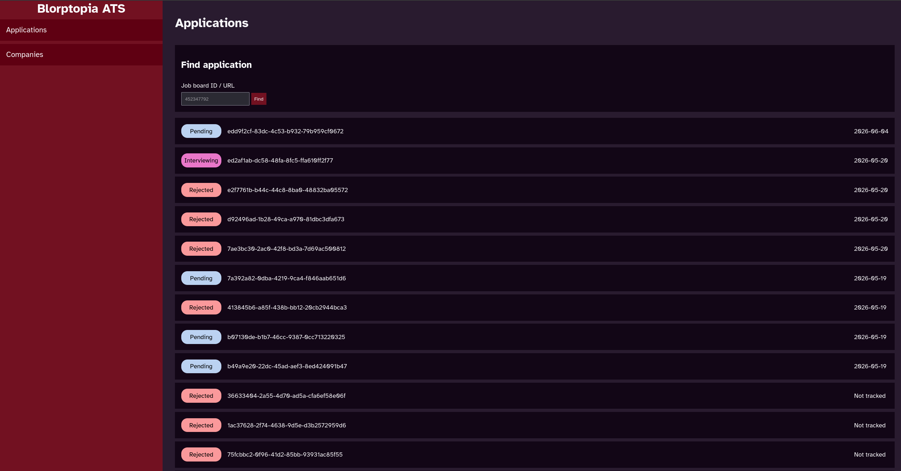
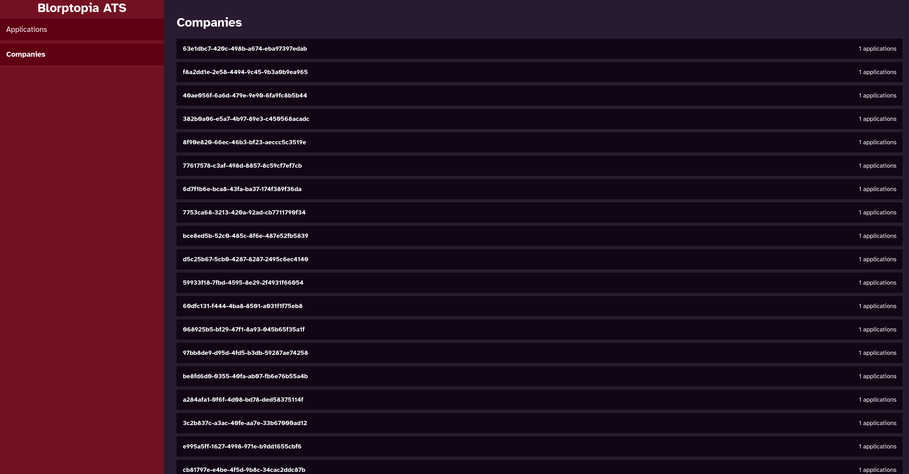

# Blorptopia's ATS
For tracking your applications to various companies.

## Warning
This was made in an afternoon with the goal of creating a quick and dirty UI around the postgres database I was previously curating by hand by manually making SQL queries.
As such, this does not support multi tenacy nor authentication nor does it plan to. The code behind this isn't *great* either :sweat_smile:, but it works and that's what matters in this specific project.

## Screenshots

